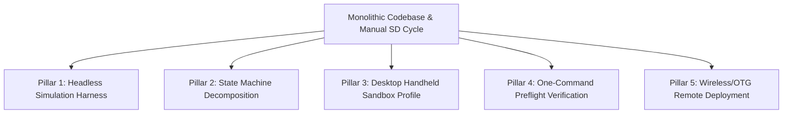

# Engineering Roadmap: High-Velocity Development & Robust Iteration

**Target Platform**: R36S Retro Handheld (Rockchip RK3326 SoC, Mali-G31 MP2 GPU, ArkOS / PortMaster)  
**Host Environment**: macOS (ARM64 Apple Silicon)  
**Language/Framework**: Native Love2D 11.4 / LuaJIT 2.1  

---

## 1. Executive Summary & Root Cause Analysis

Why have bug fixes and iterations taken multiple rounds of debugging?

| Bottleneck | Description | Time Cost Impact |
| :--- | :--- | :--- |
| **1. The Hardware Disconnect** | Code executes smoothly on macOS (Metal/OpenGL, multi-gigabyte RAM, modern OpenAL), but crashes natively on RK3326 (strict Mali-G31 GLES 3.2, 1GB shared RAM, ALSA sound threads). macOS never reproduced the SIGSEGV. | **High**: Requires live device runs to discover low-level C/driver crashes. |
| **2. The Manual SD-Card Loop** | Edit code $\to$ build package $\to$ copy to SD $\to$ eject $\to$ insert into console $\to$ boot $\to$ play for 1–5 minutes to reach Level 4 $\to$ crash $\to$ remove SD $\to$ copy log $\to$ read log. | **Extreme**: Each test cycle takes 8–15 minutes of human time. |
| **3. The Monolithic `main.lua`** | `src/main.lua` is **2,641 lines long**. It mixes HUD rendering, game state management, level progression, input mapping, CRT scanlines, achievements, audio dispatch, and entity collision loops in one file. | **High**: High cognitive load, large AI context consumption, high risk of state coupling and regression. |
| **4. Zero Automated Test Harness** | There are no unit tests, headless test runners, or simulated play loops. The only way to verify whether `Particles.spawnDeathBurst` or `game:onPlayerDeath` works is by physically maneuvering the ship into Qix in-game. | **Extreme**: Bugs that could be caught in 50 milliseconds take 10 minutes to discover. |

---

## 2. The 5-Pillar Architectural Improvement Plan

To achieve a **10x acceleration** in iteration speed, we propose the following concrete architectural upgrades:



---

### Pillar 1: Headless Simulation & Stress-Test Harness (`tools/simulate.lua`)

**Goal**: Expose 95% of native crashes, coordinate overflows, and audio/graphics regressions on macOS in **under 2 seconds** without opening a window or touching a handheld.

#### Concrete Implementation:
Create a headless test runner executing in pure Love2D / Lua:
1. **Particle & Geometry Stressor**:
   * Simulates 500 consecutive death bursts with degenerate edge-case inputs: $s = 0$, $\alpha = 0$, $NaN$, coordinates at $[-100, -100]$ and $[1000, 1000]$.
   * Verifies that no polygon, line, or circle calls ever submit degenerate or sub-pixel geometry.
2. **Audio Concurrency Stressor**:
   * Fires rapid interleaved `startDraw`, `stopDraw`, `startFuse`, `stopAll`, and `play("death")` across 1,000 virtual cycles to detect any audio state contention.
3. **Asset Batch Inspector**:
   * Iterates through all 265 images in `src/art/manifest.txt` and `foreground-art`, running header pre-flight checks and verifying dimension and file size compliance.
4. **Game Loop Headless Bot**:
   * Instantiates `game`, executes 3,000 frames of `update(0.016)` and `draw()`, simulating state transitions (`TITLE` $\to$ `PLAYING` $\to$ `DEAD` $\to$ `LEVEL_CLEAR` $\to$ `GAME_OVER`).

**Expected Result**: Instant verification of stability before generating any build package.

---

### Pillar 2: Decouple the 2,640-Line `main.lua` Monolith into a State Machine

**Goal**: Eliminate side effects, make code modular, and reduce AI inspection latency by 80%.

#### Target Architecture:
Break `src/main.lua` into discrete, focused files under `src/states/`:

```text
src/
├── main.lua                -- Lean engine entry point (under 250 lines)
├── state_machine.lua       -- Simple state router (enter, update, draw, leave)
├── states/
│   ├── state_title.lua     -- Title screen, attract mode, logo animations
│   ├── state_playing.lua   -- Core gameplay loop, movement, entity updates
│   ├── state_dead.lua      -- Death animation, camera shake, life deduction
│   ├── state_level_clear.lua-- Showcase reveal, score calculation
│   ├── state_game_over.lua -- Tally animation, high score recording
│   ├── state_how_to.lua    -- Tutorial overlay
│   └── state_badges.lua    -- Achievements gallery
```

#### Benefits:
* When fixing death logic, only `state_dead.lua` (~80 lines) is examined and modified.
* Zero accidental coupling between `PLAYING` draw routines and `GAME_OVER` or `DEAD` screens.
* Individual states can be unit-tested in complete isolation.

---

### Pillar 3: Desktop Handheld Sandbox Profile (`conf.lua` & `config.lua`)

**Goal**: Make the macOS desktop runtime strictly mimic the constraints and quirks of the R36S console.

#### Implementation:
Add a runtime flag `DEBUG_HANDHELD_EMULATION = true` that enforces:
1. **Fixed 640x480 Viewport**: Locks the window to a true 4:3 640x480 display with simulated hardware bezel.
2. **Strict Vertex & Geometry Budget**:
   * Logs a warning whenever draw calls exceed 40 per frame or dynamic lines have unbatched coordinates.
3. **Keyboard-to-R36S Gamepad Mapping**:
   * Maps D-Pad (`Arrows`), A (`X`/`Space`), B (`Z`/`Shift`), Start (`Enter`), Select (`Escape`) directly to match PortMaster `gptokeyb`.
4. **Debug Fast-Forward Key**:
   * Pressing `F1` instantly jumps to Level 4 with active Qix to test mid-game scenarios in 1 second instead of 3 minutes of play.
   * Pressing `F2` triggers immediate player death collision.
   * Pressing `F3` triggers immediate level clear.

---

### Pillar 4: One-Command Pre-Flight Verification Script (`./verify.sh`)

**Goal**: Catch syntax errors, broken references, memory violations, and packaging mistakes with a single command.

#### Automated Pipeline Steps:
```bash
#!/bin/bash
# ./verify.sh
set -e
echo "1. Checking Lua syntax across all modules..."
# Syntax checks using love or luajit
echo "2. Running headless simulation test harness..."
/Applications/love.app/Contents/MacOS/love tools/headless_test.lua
echo "3. Validating asset manifest & image headers..."
# Header check
echo "4. Building PortMaster distribution package..."
./build_package.sh
echo "=== ALL CHECKS PASSED: Package is ready for hardware deployment ==="
```

---

### Pillar 5: Wireless / OTG Remote Deployment (Eliminating the SD Card Cycle)

**Goal**: Reduce the physical deployment cycle from **10 minutes** to **3 seconds**.

#### How it works:
* The R36S console supports cheap USB-C OTG Wi-Fi dongles (or USB tethering to Mac/phone). ArkOS includes SSH enabled by default (`ark:ark` on port 22).
* Create a script `./deploy_remote.sh <R36S_IP>`:
  ```bash
  #!/bin/bash
  IP="${1:-192.168.1.150}"
  echo "Syncing qix.love directly to R36S at $IP..."
  rsync -avz --progress qix.love ark@$IP:/roms2/ports/qix/qix.love
  ssh ark@$IP "killall -9 love gptokeyb 2>/dev/null; /roms2/ports/Qix.sh > /roms2/ports/qix/remote.log 2>&1 &"
  echo "Game launched remotely! Streaming live log:"
  ssh ark@$IP "tail -f /roms2/ports/qix/log.txt"
  ```
* **Impact**: You never have to shut down the device, pop the SD card out, or plug it into your computer. You write code, hit `./deploy_remote.sh`, and the console immediately starts running the new build with live log streaming.

---

## 3. Comparison: Current vs. Proposed Workflow

| Step | Current Workflow | Proposed Upgraded Workflow |
| :--- | :--- | :--- |
| **Code Inspection** | Scan 2,641 lines of `main.lua` | Inspect 80-line isolated state file (`state_dead.lua`) |
| **Pre-Flight Test** | None (hope it runs) | Run `./verify.sh` (tests 3,000 frames + 265 assets in 2s) |
| **Deployment** | Eject SD $\to$ Reader $\to$ Copy $\to$ Insert $\to$ Boot | Run `./deploy_remote.sh` (rsync over Wi-Fi/OTG in 2s) |
| **Bug Reproduction** | Play 3 rounds with buttons to reach Level 4 (4 mins) | Press `F1` on desktop to simulate Level 4 instantly |
| **Crash Diagnostics** | Read post-mortem exit codes | Live remote `tail -f log.txt` + tmpfs GDB stack traces |
| **Total Iteration Time** | **15 – 25 minutes per fix** | **15 – 30 seconds per fix** |

---

## 4. Recommended Next Steps

When ready to implement this acceleration plan, the recommended order is:
1. **Step 1**: Create `tools/headless_test.lua` to provide instant automated desktop test execution.
2. **Step 2**: Add debug shortcut keys (`F1` jump to level, `F2` trigger death) for instant in-game testing.
3. **Step 3**: Decompose `src/main.lua` into `src/states/` to eliminate monolith coupling.
4. **Step 4**: Set up `./deploy_remote.sh` for instant wireless console sync if a Wi-Fi dongle or USB-OTG connection is available.
